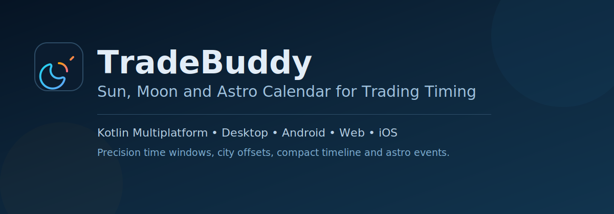
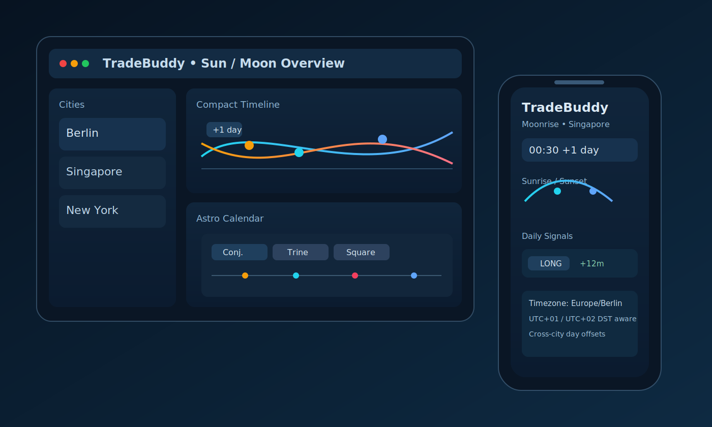

# TradeBuddy

[](https://github.com/christianarzer/TradeBuddy/actions/workflows/ci.yml)
[](https://github.com/christianarzer/TradeBuddy/actions/workflows/security.yml)
[](https://github.com/christianarzer/TradeBuddy/actions/workflows/automation.yml)
[](https://github.com/christianarzer/TradeBuddy/actions/workflows/release-drafter.yml)
[](https://github.com/christianarzer/TradeBuddy/actions/workflows/deploy-web-pages.yml)
[](LICENSE)

Trading-orientierte Zeitplanung mit Sonne, Mond und Astro-Kalender auf Kotlin Multiplatform.



- Live Web: https://christianarzer.github.io/TradeBuddy/
- Stack: Kotlin Multiplatform, Compose Multiplatform, Material 3, Coroutines/StateFlow



## Highlights

- Sun/Moon Tagesansicht fuer Sonnenaufgang, Sonnenuntergang, Mondaufgang, Monduntergang
- Kompakt-Zeitstrahl mit lokaler Zeit, optional UTC, Azimut und Status fuer bereits vergangene Events
- Astro-Kalender mit Aspektliste, Orb-Steuerung, Planet-/Aspektfiltern und Countdown
- Mondphasenansicht pro Monat
- Statistik mit Up/Down-Bewertung, Offset in Minuten, Filtern und Kennzahlen
- Settings mit moderner Theme-Auswahl, City-Filter, Log-Konsole und Monats-Export
- Monats-Export zum direkten Kopieren von Sun/Moon/Astro Zeiten

## Platform Status

- Desktop (JVM): voll funktionsfaehig
- Android: voll funktionsfaehig
- Web (Wasm): online verfuegbar
- iOS: Host vorhanden, Feature-Umfang noch reduziert

## Repository Structure

- `composeApp/`: gemeinsame Domain-, Data- und UI-Logik (Desktop/Android/iOS/Web Targets)
- `androidApp/`: Android App Modul
- `iosApp/`: iOS Host Projekt
- `.github/workflows/`: Build-, Quality-, Deploy- und Release-Pipelines

## Requirements

- JDK 17+ (empfohlen: Temurin), `JAVA_HOME` entsprechend gesetzt
- Android Studio fuer Android Builds
- Xcode fuer iOS Builds (macOS)

## Quick Start

### Desktop Run

```bash
./gradlew :composeApp:desktopRun
```

### Android Debug Build

```bash
./gradlew :androidApp:assembleDebug
```

### Web Production Distribution

```bash
./gradlew :composeApp:wasmJsBrowserDistribution
```

Output:

- `composeApp/build/dist/wasmJs/productionExecutable`

### iOS Build (Xcode CLI)

```bash
cd iosApp
xcodebuild -scheme iosApp -configuration Debug -destination 'generic/platform=iOS Simulator' CODE_SIGNING_ALLOWED=NO
```

## CI and Release

- CI (Android/Desktop/iOS/Web + Lint/Tests): `.github/workflows/ci.yml`
- Security Scans (Dependency Review, CodeQL, TruffleHog, Scorecards): `.github/workflows/security.yml`
- Repo Automation (PR Title, Labeler, Dependabot Auto-Merge, Stale): `.github/workflows/automation.yml`
- Release Draft Notes: `.github/workflows/release-drafter.yml`
- Web Deploy: `.github/workflows/deploy-web-pages.yml`
- Tag Release (`v*`): `.github/workflows/release-tag.yml`

### Pipeline Matrix

| Pipeline | Zweck | Workflow |
| --- | --- | --- |
| CI | Android/Desktop/iOS/Web + Lint/Checks | `ci.yml` |
| Security | Dependency Review, CodeQL, Secret Scan, Scorecards | `security.yml` |
| Automation | PR/Repo Automationen (Labeling, Stale, Dependabot) | `automation.yml` |
| Release Draft | Automatische Draft Release Notes | `release-drafter.yml` |
| Deploy | GitHub Pages Deployment | `deploy-web-pages.yml` |
| Release | Tag-basierter Artefakt-Release | `release-tag.yml` |

Beispiel Tag Release:

```bash
git tag -a v1.0.0 -m "Release v1.0.0"
git push origin v1.0.0
```

## Collaboration Files

- `CONTRIBUTING.md`
- `.github/ISSUE_TEMPLATE/`
- `.github/pull_request_template.md`
- `.github/dependabot.yml`

## License

Apache-2.0 (`LICENSE`)
